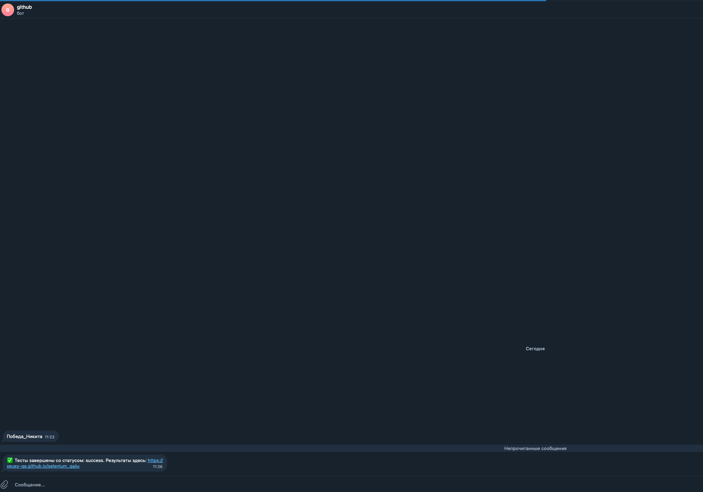
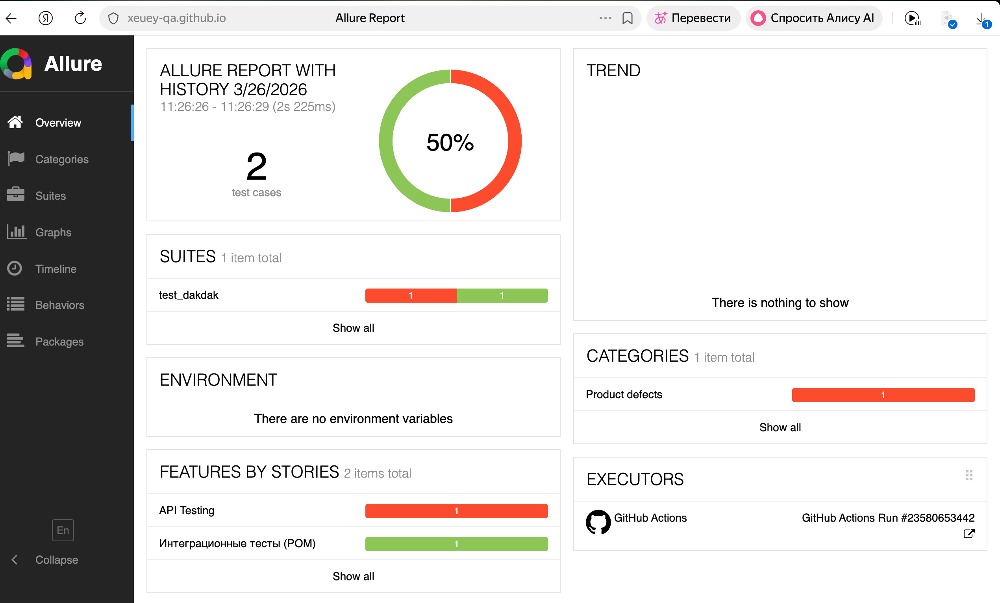

# 🎭 Automation Testing Framework: UI & API (Python)

Профессиональный фреймворк для автоматизированного тестирования, объединяющий проверку бэкенда (API) и фронтенда (UI) в единых сквозных сценариях.

[](https://www.python.org/)
[](https://www.selenium.dev/)
[](https://www.docker.com/)

---

## 🚀 Ключевые особенности проекта

* **End-to-End сценарий (API + UI):** 1. Робот обращается к внешнему API (`jsonplaceholder`) и забирает реальные данные (email пользователя).
    2. С помощью библиотеки `Faker` генерируется случайная должность (job).
    3. Робот "склеивает" эти данные в один поисковый запрос.
    4. Открывается браузер, данные вводятся в поисковую строку DuckDuckGo и имитируется нажатие `Enter`.
    5. Проверяется, что заголовок страницы изменился и содержит искомый email.
* **Page Object Model (POM):** Вся логика взаимодействия с элементами вынесена в отдельные классы для чистоты и масштабируемости кода.
* **Infrastructure-as-Code:** Полная контейнеризация через Docker. Тесты запускаются в "безголовом" (headless) режиме внутри изолированного образа.
* **CI/CD Pipeline:** Автоматический запуск тестов в GitHub Actions при каждом push в репозиторий.
* **Smart Reporting:** Если на любом этапе произойдет сбой — система пришлет уведомление в Telegram и прикрепит скриншот ошибки в Allure.

---

## 🛠 Технологический стек
| Слой | Технология |
| :--- | :--- |
| **Язык** | Python 3.11 |
| **Раннер тестов** | Pytest |
| **Браузерный движок** | Selenium WebDriver |
| **Тестирование API** | Requests |
| **Архитектура** | Page Object Model (POM) |
| **Отчетность** | Allure Report |
| **Контейнеры** | Docker (headless mode) |

---

## 🏗 Структура проекта
* `page_dak.py` — описание элементов и методов страницы DuckDuckGo (Locators & Actions).
* `test_dakdak.py` — тестовые сценарии (API тесты и интеграционный UI-тест).
* `conftest.py` — конфигурация драйвера, фикстуры и логика скриншотов при ошибках.
* `Dockerfile` — сборка окружения с предустановленным Chromium для CI/CD.

---

## 🤖 Интеграция и Уведомления

В проекте реализована система мгновенных уведомлений через Telegram-бота. При завершении пайплайна бот отправляет статус прохождения и прямую ссылку на отчет.

### Визуализация работы:

**1. Уведомление в Telegram:**


**2. Анализ падений в Allure Report:**
Система фиксирует ошибки (например, `403 Forbidden` при запросе к API) и позволяет быстро проанализировать шаги, на которых произошел сбой.


---

## 🔧 Запуск проекта

### 1. Локально
```bash
pip install -r requirements.txt
pytest --alluredir=allure-results
